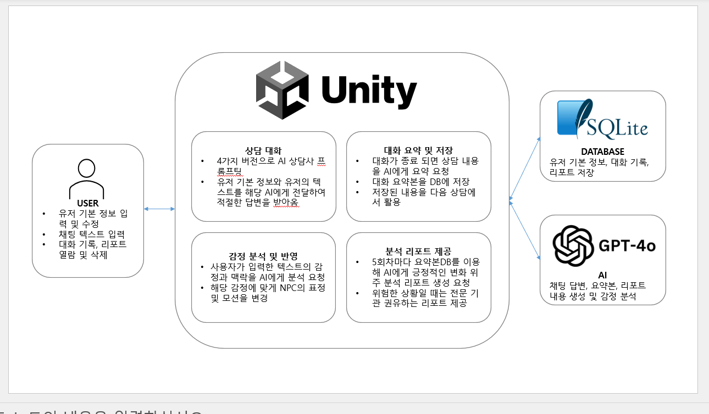

<!-- Template for PROJECT REPORT of CapstoneDesign 2024-2H, initially written by khyoo -->
<!-- 본 파일은 2024년도 컴공 졸업프로젝트의 <1차보고서> 작성을 위한 기본 양식입니다. -->
<!-- 아래에 "*"..."*" 표시는 italic체로 출력하기 위해서 사용한 것입니다. -->
<!-- "내용"에 해당하는 부분을 지우고, 여러분 과제의 내용을 작성해 주세요. -->

# Team-Info
| (1) 과제명 | 둥지톡
|:---  |---  |
| (2) 팀 번호 / 팀 이름 | 18-우주타이거 |
| (3) 팀 구성원 | 이다인 (2071034): 리더, 프론트엔드, 디자인   강예진 (1971003): 팀원, 백엔드, AI   팽지원 (2076432) : 팀원, AI, 기획		 |
| (4) 팀 지도교수 | 민동보 교수님 |
| (5) 팀 멘토 | 송용성 / 대표 / 순순 |
| (6) 과제 분류 | 산학과제 |
| (6) 과제 키워드 | NLP, LM, AI |
| (7) 과제 내용 요약 | 둥지톡은 심리적 불편감을 겪는 20-30대 청년층을 위해 연속적인 대화를 기반으로 개인 맞춤형 상담을 제공하는 인공지능 챗봇 상담 애플리케이션입니다. 주요 기능은 다음과 같습니다:  1.각기 다른 목적에 맞게 설정된 4가지 상담사가 제공되며, 사용자는 자신에게 잘 맞는 상담사를 선택해 대화할 수 있습니다. 2.상담사는 대화의 맥락에 맞춰 표정과 모션을 취해, 사용자가 대화에 더욱 몰입할 수 있도록 돕습니다. 3.상담 내용은 요약 및 저장되며, AI가 이를 기억해 연속적인 대화를 이어갑니다. 저장된 기록은 기록 보관소에서 열람할 수 있으며, 이를 분석해 맞춤형 리포트를 제공합니다. |

 

# Project-Summary
| 항목 | 내용 |
|:---  |---  |
| (1) 문제 정의 | 20-30대는 현대 사회에서 심리적 어려움을 많이 겪고 있지만, 전문 심리 상담 기관을 방문하는 데에는 심리적, 비용적, 시공간적 부담이 큽니다. 이러한 이유로 많은 사람들이 상담 기관을 찾지 못하고 있지만, 심리 상담에 최적화된 AI 챗봇 서비스는 거의 없습니다. 기존 서비스들은 이전 대화를 기억하지 못해 매번 1회성 대화로 끝나거나, 텍스트 기반의 딱딱한 상호작용으로 인해 정서적 지지가 부족하며, 보편적인 조언만을 제공해 개인 맞춤형 피드백을 기대하기 어렵습니다. |
| (2) 기존연구와의 비교 | CharacterAI - 다양한 캐릭터들과 대화를 나눌 수 있는 인공지능 컴패니언 서비스 플랫폼, 상담사 캐릭터도 일부 존재함. 장점: 다양한 성격의 AI 캐릭터를 제공하여 사용자에게 폭넓은 선택지를 제시. 최근 이전 대화 기억 기능이 개선되어 연속성을 갖춘 대화를 지원. 단점: 영어 기반 서비스로, 한국어 번역 사용 시 부자연스러움. 국내 이용자의 접근성이 떨어짐. AI가 여러 사용자 대화를 학습하는 방식이어서, 캐릭터의 성격이 일관되지 않거나 초기 성격이 붕괴되는 경우가 있음. 텍스트 기반이라 정서적 연결감이 부족. 능동적 맞춤형 피드백을 제공하지 않음.  상담냥 - 동기화 면담(MI: Motivational Interviewing) 이론을 바탕으로 설계된 상담 목적의 챗봇 어플리케이션, 상담 이론에 기반한 언어 모델 AI를 사용해 내담자에게 상담을 제공. 장점: 상담 이론에 맞춰 프롬프팅된 AI로, 심리 상담 목적으로 설계된 AI. 단점: 한 종류의 상담사만 제공되어 선택의 폭이 좁음. 이전 대화를 기억하지 못해 대화가 1회성으로 끝나며, 대화의 연속성이 부족. 텍스트 기반이라 정서적 연결감이 부족. 능동적 맞춤형 피드백을 제공하지 않음.  둥지톡이 유사 서비스에 대해 가지는 장점 1.맥락에 맞춘 그래픽 기반 반응: NPC의 표정과 모션을 통해 정서적 연결감을 제공하여, 텍스트만으로는 느끼기 어려운 친밀감과 몰입감을 제공. 2.맞춤형 피드백 리포트: 사용자의 대화 기록을 분석해, 개인 맞춤형 리포트를 능동적으로 제공. 3.상담 목적으로 설계된 다양한 캐릭터: 다양한 성격과 상담 이론에 맞춘 캐릭터들이 제공되어, 사용자가 자신의 필요에 맞는 상담사 선택 가능 4.이전 대화를 기억하는 지속성: 이전 대화를 기억해 연속적인 상담을 가능하게 하여, 사용자에게 더 일관성 있는 상담 경험을 제공. |
| (3) 제안 내용 | 1.맞춤형 상담사 선택: 사용자는 다양한 성격을 가진 상담사 중에서 자신에게 맞는 상담사를 선택해 더 효과적인 상담을 받을 수 있음. 2.NPC의 표정과 모션: 감정 변화에 따른 즉각적인 그래픽 기반의 NPC의 반응을 제공하여 사용자가 상담에 더 몰입할 수 있게 돕고 정서적 연결감 제공. 3.연속적인 상담 기록 관리: 상담 내용이 자동으로 요약되고 저장되어, 매번 같은 내용을 반복 설명할 필요 없이 지속적인 상담 제공. 4.맞춤형 분석 리포트 제공: 상담 기록을 바탕으로 한 분석 리포트를 통해 사용자는 자신의 감정 변화를 파악하고 지지감을 얻을 수 있음. |
| (4) 기대효과 및 의의 | 1.심리적 안정감: 연속적인 개인 맞춤형 대화를 통해 사용자가 자신만을 위한 상담을 받는 느낌을 제공하며, 상담 후 리포트로 긍정적인 변화를 칭찬해 줌으로써 심리적 지지를 느끼게 합니다. 2.몰입감 향상: NPC의 자연스러운 반응으로 상담의 몰입감을 높이고, 정서적 지지를 제공합니다. 3.접근성 향상: 비용 부담 없이 언제 어디서나 개인 맞춤형 상담을 받을 수 있는 서비스로 접근성을 강화합니다. |
| (5) 주요 기능 리스트 | 1.다양한 NPC 제공: 성격과 상담 이론에 맞춘 여러 NPC. 2.NPC 표정 및 모션: 감정에 맞춘 표정과 모션 상호작용. 3.기록 보관소: 대화 기록 요약, 저장 및 열람, 삭제 기능. 4.연속 대화 기능: 저장된 기록을 활용한 연속 상담. 5.맞춤형 분석 리포트: 감정 변화와 상담 진행 상황에 대한 긍정적 피드백. 6.리포트 보관소: 생성된 리포트의 저장, 열람, 삭제 기능. 7.사용자 정보 관리: 사용자 기본 정보 저장, 편집 및 AI 기억 기능.|

 
 
# Project-Design
| 항목 | 내용 |
|:---  |---  |
| (1) 요구사항 정의 | *프로젝트를 완성하기 위해 필요한 요구사항을 설명하기에 가장 적합한 방법을 선택하여 기술*   예)   - 기능별 상세 요구사항(또는 유스케이스)   - 설계 모델(클래스 다이어그램, 클래스 및 모듈 명세서)   - UI 분석/설계 모델   - E-R 다이어그램/DB 설계 모델(테이블 구조) |
| (2) 전체 시스템 구성 |  |
| (3) 진척도 및 검증내역 | 스타트 단계에서는 주요 기능인 4가지 상담사 프롬프팅, 분류에 따른 모션 반응, 대화의 연속성 및 리포트 생성 가능성을 확인하였습니다. 이로써 전체 개발 일정 대비 약 35% 진행되었음을 검증했습니다.  현재 단계에서는 새로운 그래픽 Asset을 적용 중이며, DB 설계와 AI 연결을 보완하고 있습니다. 이로 인해 전체 프로젝트의 60% 정도가 완료된 상태입니다. |
| (4) 기타 | *기타 사항을 기술* |

 
