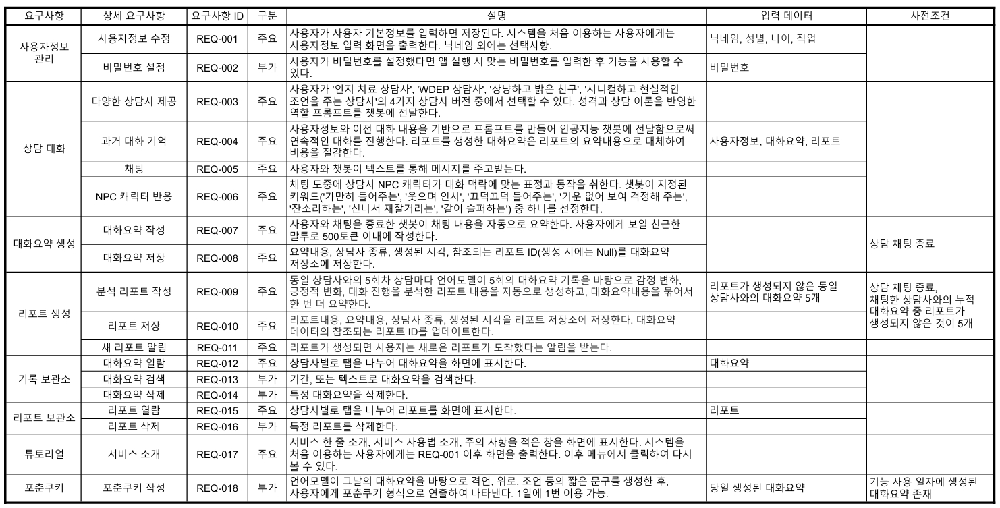
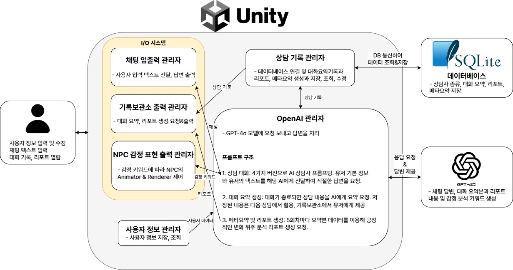
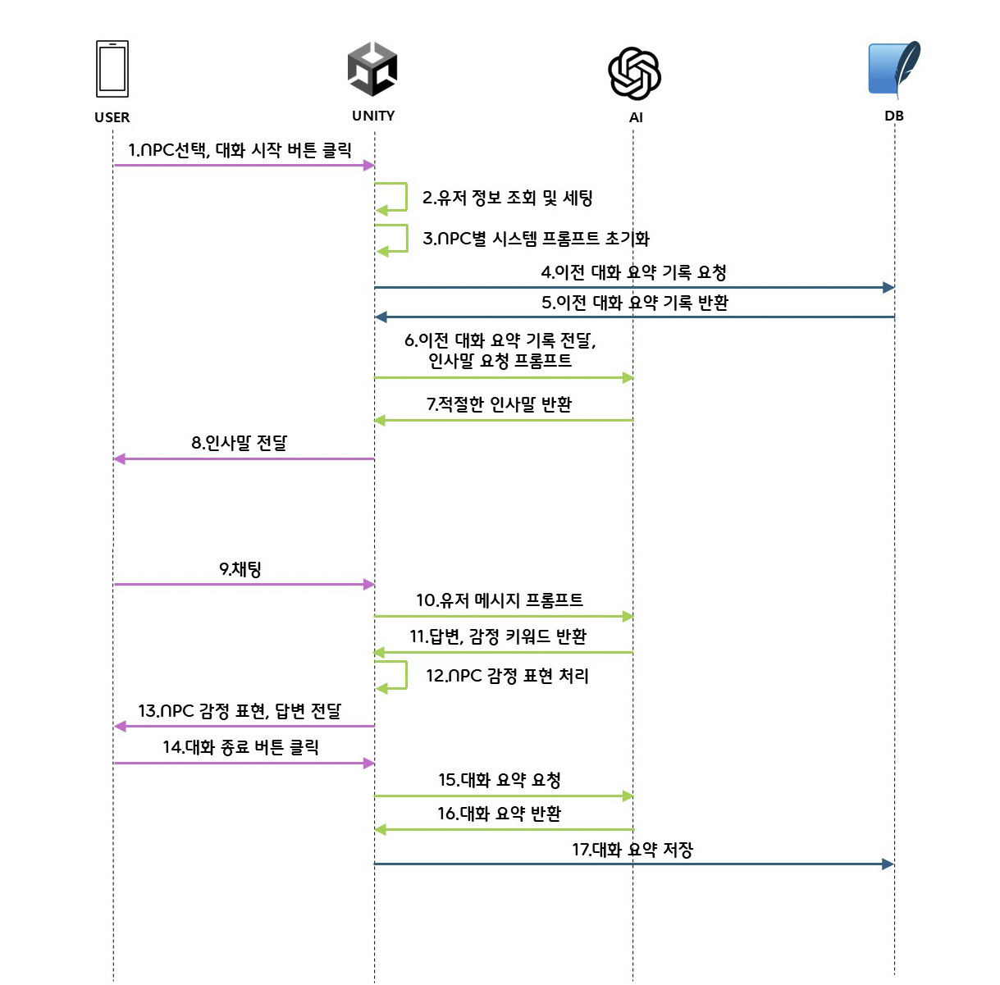
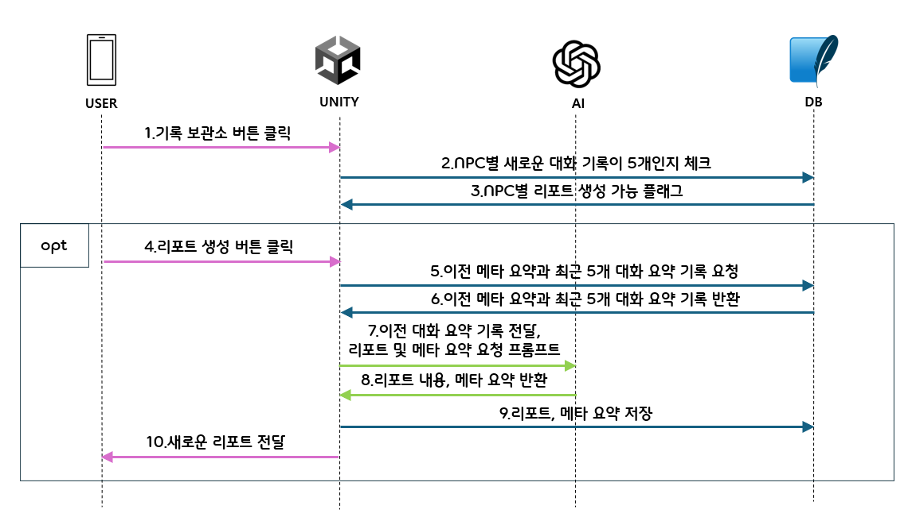

<!-- Template for PROJECT REPORT of CapstoneDesign 2024-2H, initially written by khyoo -->
<!-- 본 파일은 2024년도 컴공 졸업프로젝트의 <1차보고서> 작성을 위한 기본 양식입니다. -->
<!-- 아래에 "*"..."*" 표시는 italic체로 출력하기 위해서 사용한 것입니다. -->
<!-- "내용"에 해당하는 부분을 지우고, 여러분 과제의 내용을 작성해 주세요. -->

# Team-Info
| (1) 과제명 | 둥지톡
|:---  |---  |
| (2) 팀 번호 / 팀 이름 | 18-우주타이거 |
| (3) 팀 구성원 | 이다인 (2071034): 리더, 프론트엔드, 디자인   강예진 (1971003): 팀원, 백엔드, AI   팽지원 (2076432) : 팀원, AI, 기획		 |
| (4) 팀 지도교수 | 민동보 교수님 |
| (5) 팀 멘토 | 송용성 / 대표 / 순순 |
| (6) 과제 분류 | 산학과제 |
| (6) 과제 키워드 | NLP, LM, AI |
| (7) 과제 내용 요약 | 둥지톡은 심리적 불편감을 겪는 20-30대 청년층을 위해 연속적인 대화를 기반으로 개인 맞춤형 상담을 제공하는 인공지능 챗봇 상담 애플리케이션입니다. Unity 엔진을 기반으로 프롬프팅은 OpenAI(GPT-4o), 데이터베이스는 SQLite를 사용하며, 주요 기능은 다음과 같습니다:  1. 각기 다른 목적에 맞게 설정된 4가지 상담사가 제공되며, 사용자는 자신에게 잘 맞는 상담사를 선택해 대화할 수 있습니다.  2. 상담사는 대화의 맥락에 맞춰 표정과 모션을 취해, 사용자가 대화에 더욱 몰입할 수 있도록 돕습니다.  3. 상담 내용은 요약 및 저장되며, AI가 이를 기억해 연속적인 대화를 이어갑니다. 저장된 기록은 기록 보관소에서 열람할 수 있으며, 이를 분석해 맞춤형 리포트를 제공합니다. |

 

# Project-Summary
| 항목 | 내용 |
|:---  |---  |
| (1) 문제 정의 | - 20-30대는 현대 사회에서 심리적 어려움을 많이 겪고 있지만, 전문 심리 상담 기관을 방문하는 데에는 심리적, 비용적, 시공간적 부담이 큽니다. 이러한 이유로 많은 사람들이 상담 기관을 찾지 못하고 있지만, 심리 상담에 최적화된 AI 챗봇 서비스는 거의 없습니다.  - 기존 서비스들은 이전 대화를 기억하지 못해 매번 1회성 대화로 끝나거나, 텍스트 기반의 딱딱한 상호작용으로 인해 정서적 지지가 부족하며, 보편적인 조언만을 제공해 개인 맞춤형 피드백을 기대하기 어렵습니다. |
| (2) 기존연구와의 비교 | ▫ CharacterAI - 다양한 캐릭터들과 대화를 나눌 수 있는 인공지능 컴패니언 서비스 플랫폼, 상담사 캐릭터도 일부 존재함.  장점: - 다양한 성격의 AI 캐릭터를 제공하여 사용자에게 폭넓은 선택지를 제시. - 최근 이전 대화 기억 기능이 개선되어 연속성을 갖춘 대화를 지원.  단점: - 영어 기반 서비스로, 한국어 번역 사용 시 부자연스러움. 국내 이용자의 접근성이 떨어짐. AI가 여러 사용자 대화를 학습하는 방식이어서, 캐릭터의 성격이 일관되지 않거나 초기 성격이 붕괴되는 경우가 있음. - 텍스트 기반이라 정서적 연결감이 부족. - 능동적 맞춤형 피드백을 제공하지 않음.   ▫ 상담냥 - 동기화 면담(MI: Motivational Interviewing) 이론을 바탕으로 설계된 상담 목적의 챗봇 어플리케이션, 상담 이론에 기반한 언어 모델 AI를 사용해 내담자에게 상담을 제공.  장점: - 상담 이론에 맞춰 프롬프팅된 AI로, 심리 상담 목적으로 설계된 AI.  단점: - 한 종류의 상담사만 제공되어 선택의 폭이 좁음. - 이전 대화를 기억하지 못해 대화가 1회성으로 끝나며, 대화의 연속성이 부족. - 텍스트 기반이라 정서적 연결감이 부족. 능동적 맞춤형 피드백을 제공하지 않음.   ✔ 둥지톡이 유사 서비스에 대해 가지는 장점  1. 맥락에 맞춘 그래픽 기반 반응: NPC의 표정과 모션을 통해 정서적 연결감을 제공하여, 텍스트만으로는 느끼기 어려운 친밀감과 몰입감을 제공.  2. 맞춤형 피드백 리포트: 사용자의 대화 기록을 분석해, 개인 맞춤형 리포트를 능동적으로 제공.  3. 상담 목적으로 설계된 다양한 캐릭터: 다양한 성격과 상담 이론에 맞춘 캐릭터들이 제공되어, 사용자가 자신의 필요에 맞는 상담사 선택 가능. (인지치료, WDEP, 상냥, 시니컬)  4. 이전 대화를 기억하는 지속성: 이전 대화를 기억해 연속적인 상담을 가능하게 하여, 사용자에게 더 일관성 있는 상담 경험을 제공. |
| (3) 제안 내용 | 1. 맞춤형 상담사 선택: 사용자는 다양한 성격을 가진 상담사 중에서 자신에게 맞는 상담사를 선택해 더 효과적인 상담을 받을 수 있음.  2. NPC의 표정과 모션: 감정 변화에 따른 즉각적인 그래픽 기반의 NPC의 반응을 제공하여 사용자가 상담에 더 몰입할 수 있게 돕고 정서적 연결감 제공.  3. 연속적인 상담 기록 관리: 상담 내용이 자동으로 요약되고 저장되어, 매번 같은 내용을 반복 설명할 필요 없이 지속적인 상담 제공.  4. 맞춤형 분석 리포트 제공: 상담 기록을 바탕으로 한 분석 리포트를 통해 사용자는 자신의 감정 변화를 파악하고 지지감을 얻을 수 있음. |
| (4) 기대효과 및 의의 | 1. 심리적 안정감: 연속적인 개인 맞춤형 대화를 통해 사용자가 자신만을 위한 상담을 받는 느낌을 제공하며, 상담 후 리포트로 긍정적인 변화를 칭찬해 줌으로써 심리적 지지를 느끼게 합니다.  2. 몰입감 향상: NPC의 자연스러운 반응으로 상담의 몰입감을 높이고, 정서적 지지를 제공합니다.  3. 접근성 향상: 비용 부담 없이 언제 어디서나 개인 맞춤형 상담을 받을 수 있는 서비스로 접근성을 강화합니다. |
| (5) 주요 기능 리스트 | 1. 다양한 NPC 제공: 성격과 상담 이론에 맞춘 여러 NPC.  2. NPC 표정 및 모션: 감정에 맞춘 표정과 모션 상호작용.  3. 기록 보관소: 대화 기록 요약, 저장 및 열람, 삭제 기능.  4. 연속 대화 기능: 저장된 기록을 활용한 연속 상담.  5. 맞춤형 분석 리포트: 감정 변화와 상담 진행 상황에 대한 긍정적 피드백.  6. 리포트 보관소: 생성된 리포트의 저장, 열람, 삭제 기능.  7. 사용자 정보 관리: 사용자 기본 정보 저장, 편집 및 AI 기억 기능.|

 
 
# Project-Design & Implementation
| 항목 | 내용 |
|:---  |---  |
| (1) 요구사항 정의 | 다음은 서비스의 Use Case입니다.   

   다음은 Use Case별로 자세한 기능 요구사항을 나타낸 표입니다.    |
| (2) 전체 시스템 구성 | 다음은 서비스의 구조와 주요 모듈 및 주요 기능에 대한 데이터 흐름을 그림으로 나타낸 소프트웨어 구조도이다.       SW 구조는 다음과 같다.   1. 클라이언트 - Unity: 사용자 인터페이스(UI)와 상호작용 제공, 서비스 로직 처리.   2. 데이터베이스 - SQLite: 대화 요약, 리포트, 메타 요약 등의 상담 기록 저장.   3. 인공지능 - OpenAI:  GPT-4o 모델에서 프롬프트 엔지니어링을 통해 인사말과 답변 및 감정 표현 키워드, 대화 요약과 리포트 내용 생성.    구성 요소 간의 상호작용과 통신에 대한 설명이다.   - 사용자↔Unity: 사용자가 클라이언트와 상호작용하여 서비스를 이용   - Unity↔SQLite: Unity 프로젝트가 데이터베이스와 통신하여 데이터를 조회하거나 저장   - Unity↔OpenAI: 인사말과 답변 및 감정 표현 키워드, 대화 요약과 리포트 내용을 요청하고 응답을 제공 |
| (3) 주요엔진 및 기능 설계 | 서비스에서 사용되는 주요 모듈에 대한 구현 내용은 다음과 같다.    **1. 채팅 입출력 관리자**  Unity에서 사용자의 입력 텍스트를 OpenAI에 전달하고, 그에 대한 AI의 답변 텍스트를 메신저 채팅 형식으로 화면에 출력한다. 메인 스크립트는 ChatManger.cs이며, 주요 기능은 다음과 같다.    - 사용자 메시지 전달 : OpenAI에 사용자가 입력한 텍스트를 전달하고 응답을 요청한다.   - OpenAI의 응답 불러오기 : GPT-4o 모델의 응답을 불러와 화면에 출력한다.   - 채팅 말풍선 : 화자에 맞는 프로필 사진, 이름, 텍스트 내용, 현재 시각, 말풍선 색깔 등을 설정하고 화면에 나타낸다.    **2. 기록 보관소 출력 관리자**   Unity의 ReportStorage 씬에서 DB에 저장된 대화 요약본과 리포트 생성 요청 및 출력을 담당한다. 메인 스크립트는 DialogueManager.cs와 ReportManager.cs이며, 주요 기능은 다음과 같다.    - 대화 요약본 불러오기 : 로컬 DB에 있는 상담사별 모든 대화 요약본 데이터를 불러와 출력한다.   - Dialogue 프리팹 오브젝트 생성 : 불러온 대화 요약본 텍스트, 담당 상담사 프로필 사진, 요약본 생성 날짜 등을 설정하고 화면에 나타낸다.   - Dialogue 개수 체크 : 특정 상담사의 대화 요약본이 5개 이상이면 canMakeReport 플래그를 true로, 아니면 false로 설정하여 리포트 생성 가능 여부를 판단한다. true일 경우 리포트 생성 버튼을 활성화한다. 리포트 생성은 Strength(2) 상담사를 제외한 나머지 3가지 상담사만 가능하다.   - 리포트 생성 : 활성화된 리포트 생성 버튼 클릭 시, 해당 상담사의 이름과 프로필 사진을 설정하고 OpenAI에 리포트 생성을 요청한다. 리포트가 생성되면 화면에 팝업창으로 나타낸다.    **3. 데이터베이스**   SQLite를 데이터베이스 시스템으로 사용한다. SQLite를 선택한 이유는 우선 Unity 프로젝트에서 설치와 관리가 간편하고, 이후 다른 플랫폼으로 확장에 유리하기 때문이다. 또한, 로컬에서 데이터를 관리하여 빠른 응답 속도와 오프라인 서비스 지원이 가능하며, 보안에 대한 위험을 줄이는 장점이 있기 때문이다.    데이터베이스는 상담사 종류, 대화 요약, 리포트를 저장하기 위한 세 개의 테이블로 구성되어 있다. - Counselor 테이블: 서비스에서 제공하는 상담사 종류를 고유 ID로 구분한다. 현재 단계에서는 Cognitive(1), Strength(2), Kind(3), Cynical(4)의 네 가지 상담사가 있다. - SessionLog 테이블: 사용자의 채팅 내용을 요약하여 저장하며, 지난 대화 확인과 연속된 상담을 제공하는 데 사용된다. 요약한 내용과 생성 시각을 저장하며, 어떤 상담사와 한 대화인지 구분하기 위해 Counselor 테이블과 1:1 매핑된다. 리포트 생성 여부를 판단하기 위해 ReportLog 테이블과 1:1 매핑되고, 리포트 ID는 기본값으로 Null을 가지며 리포트 생성 시 업데이트된다. - ReportLog 테이블: 리포트의 내용과 메타 요약 정보, 생성시각을 저장한다. Counselor 테이블과 1:1 매핑하여 어떤 상담사와 한 대화에 관해 생성된 리포트인지 구분한다.    **4. 사용자 정보 관리자**   닉네임, 성별, 나이, 직업과 같은 사용자 개인정보를 저장하고 조회한다. Unity에서 지원하는 Playerprefs 클래스를 사용하였으며, 메인 스크립트는 UserDataManager.cs이다.    **5. 상담 기록 관리자**   Unity에서 SQLite를 활용해 데이터베이스 작업을 수행하며, DataService.cs 스크립트를 통해 구현했다. 포함된 기능은 다음과 같다.    - 경로 설정 및 데이터베이스 연결: Unity 에디터와 Android 애플리케이션, 추후 플랫폼 확장까지 고려해 iOS 등 다양한 플랫폼에서 데이터베이스 파일의 경로를 적절히 설정하고, 생성자를 사용해 데이터베이스 파일을 연결한다. - 상담사 ID 조회: 상담사의 이름을 받아 매핑된 ID를 반환함으로써 코드에서 상담사를 쉽게 식별할 수 있게 한다. - 대화 기록 조회: 특정 상담사 ID를 기준으로 필터링된 모든 대화 데이터를 생성 시각 순으로 정렬하여 반환한다. - 리포트를 생성하지 않은 대화 기록 조회: 아직 리포트가 생성되지 않은 대화 기록을 특정 상담사 ID로 필터링하여 생성 시각 순으로 정렬하여 반환한다. - 리포트 조회: 특정 상담사 ID를 기준으로 필터링된 모든 리포트 데이터를 생성 시각 순으로 정렬해 반환한다. - 데이터 삽입 및 삭제: 대화 기록과 리포트 데이터를 삽입하거나 삭제하는 기능을 제공한다.  - 대화 요약 데이터를 이용한 프롬프트 메시지 작성: 특정 상담사와의 이전 대화 요약을 가져와 ChatGPT가 참고할 수 있도록 프롬프트 string을 정해진 형식에 맞추어 생성한다. 새로운 상담 채팅 시작 시에는 특정 상담사의 리포트 데이터 속 메타요약과 리포트 미생성 대화 데이터를 가져온다. 단, ‘장점 찾기 상담사’의 경우 연속 상담을 지원하지 않으므로 정해진 문구만을 반환하도록 처리한다. 리포트 생성시에는 특정 상담사의  리포트 미생성 대화 데이터를 사용한다. - 리포트 생성 조건 검사: 특정 상담사에 대해 리포트를 생성하지 않은 대화 데이터가 5개인지 확인하여 리포트 생성 가능 여부를 판단한다. - 대화 기록 수정: 새로운 리포트를 생성한 후, 해당 리포트에 관여한 대화 기록의 리포트 ID 속성을 업데이트한다.    **6. OpenAI 관리자**   Unity에서 OpenAI API를 사용하여 프롬프트 엔지니어링을 통해 GPT-4o 모델에 요청을 보내고 적절한 답변을 받아 처리한다. OpenAIController.cs 스크립트에서 구현되었으며, 주요 과정은 다음과 같다.   - 사용자 정보와 상담사 설정:  현재 시각과 사용자의 닉네임, 성별, 나이, 직업 정보를 불러오고, 4가지 상담사 버전 중 선택한 상담사의 종류를 확인하여 적절한 SystemMessage를 구성한다. - 과거 대화 요약 전달: 상담 기록 관리 모듈로부터 가져온 과거 대화 요약 데이터를 UserMessage로 구성한다. - OpenAI API 통신: Unity 에디터와 Android 플랫폼에 따라 파일 접근 방식을 다르게 설정하여 OpenAI API Key를 불러온다. 사용자로부터 받은 메시지를 UserMessage로 추가하고, 코루틴을 통해 OpenAI API에 POST 요청을 보내 응답을 받는다. 그리고 JSON 형태로 받은 응답을 파싱한다. - 응답 처리: 파싱된 응답 데이터를 처리하고, 그 결과에 따라 후속 작업을 수행한다. 사용자와의 채팅에 대한 응답인 경우,  감정표현 키워드를 지정된 구분자 "#”을 사용하여 분리하고, 이를 NPC 감정 표현 출력 관리자 모듈에 전달한다. 채팅 답변에 대한 내용을 ChatManager 모듈을 통해 화면에 표시한다.  대화 요약이나 리포트 생성 요청에 대한 응답인 경우, 응답에서 "SUMMARY:”,  "REPORT:”와 같은 코멘트를 삭제하고, 상담 기록 관리 모듈을 통해 데이터베이스에 저장한다. 리포트 생성에 대한 응답인 경우 "METASUMMARY:” 구분자를 사용하여 리포트 내용과 메타 요약을 분리하여 저장하는 작업을 추가한다. - 요약 요청 전달: 사용자와의 상담 대화가 종료될 때, 이번 회차의 대화를 요약하도록 요청하는 UserMessage를 API에 전달하여 이에 대한 응답을 받는다.    **7. NPC 감정 표현 출력 관리자**   감정 표현 키워드에 따라 NPC  캐릭터의 Animator와 얼굴 텍스처 Renderer를 제어한다. NPCEmotionManager.cs 스크립트에서 구현되었다. |
| (4) 주요 기능의 구현 |     |
| (5) 기타 |  |

 
